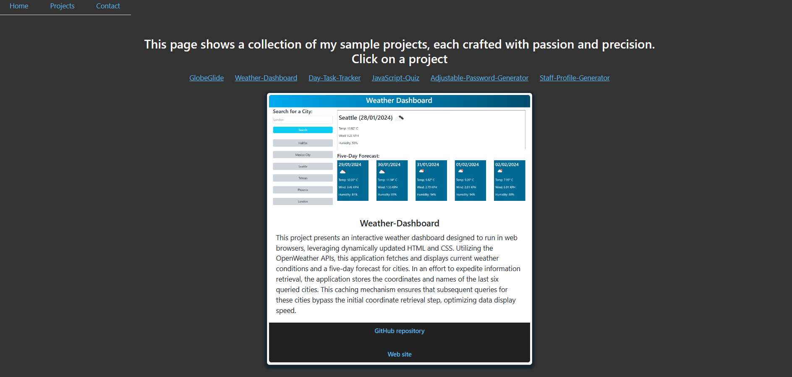

# ReactJS Portfolio

## Description

This project serves as a demonstration of a portfolio design implemented with React JS. The portfolio encompasses three primary pages: Home, Projects, and Contact.

Home Page
The Home page functions as a welcoming landing page, presenting essential information such as name, a brief summary of skills, and a personal photo.

Projects Page
The Projects page hosts links to various web application projects.

Contact Page
The Contact page is designed to facilitate communication, providing contact details including email address, phone number, and links to the GitHub profile, LinkedIn page, and a downloadable CV in PDF format.

Below figure shows a screen shot of the application.

<figure>
    
    <figcaption><em>A sample project page</em></figcaption>
</figure>

## Installation

N/A

## Credits

The following resources were used.

- [React](https://react.dev/)
- [React Bootstrap](https://react-bootstrap.github.io/)
- [Bootstrap](https://getbootstrap.com/)
- [Coolers](https://coolors.co/)

## License

Please see the [License](./LICENSE).
